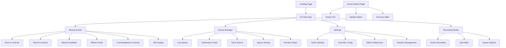
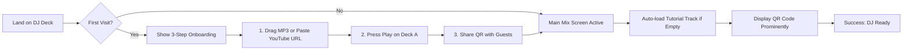
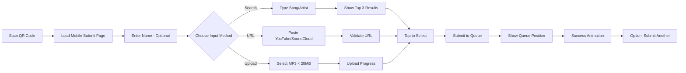
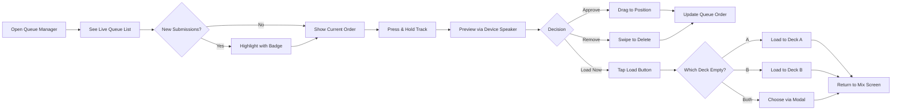
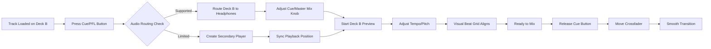

# Wibbly Wobblaz DJ Deck UI/UX Specification

## Introduction

This document defines the user experience goals, information architecture, user flows, and visual design specifications for Wibbly Wobblaz DJ Deck's user interface. It serves as the foundation for visual design and frontend development, ensuring a cohesive and user-centered experience.

### Overall UX Goals & Principles

#### Target User Personas

**1. The Mobile DJ** - Party hosts using phones/tablets as their primary DJ interface. They need touch-optimized controls with the decks and mixer on one screen, with separate queue management.

**2. The Guest Contributor** - Party attendees using mobile devices to submit songs via QR code. They expect zero-friction submission with no app downloads or accounts.

**3. The Desktop Power User** - DJs with larger screens who can see expanded views, but the mobile experience remains the priority.

#### Usability Goals

- **Mobile-First Everything:** All DJ features fully functional on phone screens, enhanced (not required) on desktop
- **Two-Screen Architecture:** Primary mixing screen (decks + controls) and dedicated queue management screen
- **Instant Gratification:** QR scan to song submission completed in under 30 seconds
- **Touch-Optimized Controls:** All interactions designed for thumb reach and gesture control
- **Continuous Flow:** Music never stops, with auto-mix preventing dead air

#### Design Principles

1. **Mobile-First, Desktop-Enhanced** - Every feature works perfectly on mobile; desktop adds convenience, not capability
2. **Mixing Unity** - Decks and mix controls always visible together for continuous performance control
3. **Queue Independence** - Separate, fully-featured queue management screen for curation without interrupting mixing
4. **Visual Performance Over Technical Accuracy** - The perception of beatmatching matters more than actual audio synchronization
5. **Real-time Feedback Everything** - Every action has immediate visual/audio response under 100ms
6. **Glitch as Identity** - BPM-synced glitch effects aren't just decoration, they're core to the Wibbly Wobblaz experience

#### Change Log

| Date | Version | Description | Author |
|------|---------|-------------|--------|
| 2025-09-03 | v1.0 | Initial DJ Deck UI/UX Specification | Sally (UX Expert) |

## Information Architecture (IA)

### Site Map / Screen Inventory

### Navigation Structure

**Primary Navigation (Mobile):**
- Bottom tab bar with 4 icons:
  - 🎛️ Mix (default active)
  - 📋 Queue 
  - ⚙️ Settings
  - 🔴 Record
- Tab bar persists across all DJ screens
- Visual indicator for active screen
- Badge notifications on Queue tab for new submissions

**Secondary Navigation:**
- Within Mixing Screen: Swipe gestures to toggle effect panels
- Within Queue Manager: Pull-to-refresh for new submissions
- Settings: Standard iOS/Android navigation patterns

**Breadcrumb Strategy:**
- Not needed for mobile (flat hierarchy)
- Desktop: Minimal breadcrumbs only in Settings sub-pages

## User Flows

### Flow 1: First-Time DJ Setup

**User Goal:** Start DJing within 60 seconds of landing on the DJ Deck page

**Entry Points:** 
- Landing page "Start DJing" CTA
- Direct URL to /dj
- Return visit bookmark

**Success Criteria:** Music playing from first track with visible QR code for guests

**Edge Cases & Error Handling:**
- No audio permissions: Show permission request with explanation
- Mobile browser limitations: Suggest Chrome/Safari for best experience
- Empty decks: Auto-load demo track with prompt to add music
- Network issues: Cache core UI, show connection status

**Notes:** Onboarding must be skippable for returning users. Tutorial track should be upbeat, royalty-free, and showcase glitch effects.

### Flow 2: Guest Song Submission via QR

**User Goal:** Submit a song request in under 30 seconds from QR scan

**Entry Points:**
- QR code scan from DJ's screen
- Shared link via messaging
- NFC tap (if implemented)

**Success Criteria:** Song added to queue with position confirmation

**Edge Cases & Error Handling:**
- Rate limiting hit: Show "Please wait X minutes" with countdown
- Invalid URL: Suggest format with examples
- Upload too large: Compress or reject with explanation
- Queue full: Show "Party at capacity" with retry option
- Duplicate song: Allow but mark as "Requested again by [Name]"

**Notes:** No authentication required. IP-based rate limiting. Success screen should encourage social sharing.

### Flow 3: Queue Management & Track Loading

**User Goal:** Review submissions, reorder queue, and load next track seamlessly

**Entry Points:**
- Queue tab from Mix screen
- New submission notification badge
- Auto-mix needs next track

**Success Criteria:** Track loaded to empty deck without stopping current playback

**Edge Cases & Error Handling:**
- No empty deck: Prompt to stop current track or wait
- Track unavailable: Show error, auto-skip to next
- Preview fails: Indicate "Preview unavailable, load to test"
- Simultaneous edits: Last write wins with optimistic UI

**Notes:** WebSocket updates keep queue synchronized. Deleted tracks saved to "Recently Removed" for 5 minutes.

### Flow 4: Headphone Cueing & Beatmatching

**User Goal:** Preview and prepare the next track while current track plays

**Entry Points:**
- Cue button on either deck
- Headphone icon in settings
- Auto-enabled when headphones detected

**Success Criteria:** DJ hears cued track in headphones while audience hears master

**Edge Cases & Error Handling:**
- No headphone output: Fallback to visual-only beatmatching
- Browser blocks audio routing: Explain limitation, suggest workaround
- Bluetooth latency: Warn about delay, recommend wired
- Phone call interruption: Pause cue, maintain master output

**Notes:** Visual beat grids crucial when true audio routing impossible. Tempo adjustment may be visual-only for streaming sources.

## Wireframes & Mockups

**Primary Design Files:** To be created in Figma/v0/Lovable based on these specifications

### Key Screen Layouts

#### Mobile Mixing Screen (Primary)

**Purpose:** Main DJ performance interface with both decks and all mixing controls visible

**Key Elements:**
- Top Bar: Session timer, connection status, "Now Playing" track info
- Deck A (Upper half): Turntable visualization, play/pause, cue button, pitch slider, BPM display
- Deck B (Lower half): Matching turntable visualization and controls
- Center Strip: Crossfader (large, thumb-friendly), volume faders, 3-band EQ knobs
- Bottom Tab Bar: Mix (active), Queue (with badge for new submissions), Settings, Record
- Floating Action: Auto-mix toggle button
- Visual Effects: Glitch overlay responding to BPM

**Interaction Notes:** Vertical layout optimized for one-handed portrait use. Crossfader is extra tall (80px) for precise thumb control. Pinch to zoom on waveforms. Swipe up on deck to load from queue. Badge on Queue tab alerts DJ to new submissions.

**Design File Reference:** [Mobile_Mixing_Screen_v1]

#### Mobile Queue Manager Screen

**Purpose:** Complete music library management - browse own files, manage guest submissions, search all sources

**Key Elements:**
- Header: "Queue (12)" with live count, filter dropdown, search icon
- Tab Sub-Navigation: "Guest Queue" | "My Library" | "Search All"
- QR Code Section (Guest Queue tab): Large, scannable QR code (200x200px min) with "Guests: Scan to Add Songs" text
- My Library Tab: Local MP3s, YouTube history, SoundCloud likes, folder navigation
- Search All Tab: Unified search across YouTube, SoundCloud, and local files
- Submission Alert: Yellow banner for new entries "3 new submissions"
- Queue List: Draggable cards with track info, contributor name (if guest), source icon
- Each Card: Thumbnail, title, artist, duration, load buttons (A/B), delete swipe
- Preview Bar: Sticky bottom player when track selected
- Pull-to-refresh: Update submissions
- Upload FAB: Floating "+" button to add local MP3s or paste URLs

**Interaction Notes:** QR code visible in Guest Queue tab. File browser for local MP3s in My Library tab. Long press for preview (haptic feedback). Drag handle on left for reordering. Batch selection mode with long press. Swipe right for quick-load to empty deck.

**Design File Reference:** [Mobile_Queue_Manager_v1]

#### Guest Submit Page (Mobile Web)

**Purpose:** Zero-friction song submission after QR scan

**Key Elements:**
- Minimal Header: "Add Your Song" with party session name
- Optional Name Field: "Your name (optional)" with skip button
- Three Large Buttons: "Search Songs" | "Paste Link" | "Upload MP3"
- Search View: Single input, instant results, tap to select
- Success Screen: Big checkmark, "You're #5 in queue!", "Add Another" button
- Rate Limit Message: Friendly timeout countdown
- No navigation: Single purpose page

**Interaction Notes:** Auto-focus on first field. Large touch targets (min 60px). Immediate feedback on every action. Success animation with haptic on native.

**Design File Reference:** [Guest_Submit_Flow_v1]

#### Desktop Expanded View

**Purpose:** Enhanced layout for larger screens while maintaining mobile-first principles

**Key Elements:**
- Three-Panel Layout: Queue (left), Mixing (center), Effects/Recording (right)
- Expanded Decks: Full waveforms, more precise controls, loop controls visible
- Queue sidebar: Always visible with live updates
- Effects Panel: All effects visible simultaneously, not hidden in mobile menu
- Recording Panel: Waveform of recording, trim controls, export options
- Persistent QR Code: Larger, always visible in header

**Interaction Notes:** Keyboard shortcuts supported (spacebar = play/pause, arrow keys = pitch). Drag and drop from queue to specific deck. Multi-track selection with shift-click.

**Design File Reference:** [Desktop_Expanded_Layout_v1]

## Component Library / Design System

**Design System Approach:** Extend the existing Wibbly Wobblaz Tailwind configuration with DJ-specific components. Use native HTML5 audio/video elements where possible, enhanced with custom React components for touch interactions and visual feedback.

### Core Components

#### Turntable Component

**Purpose:** Visual representation of a deck with spinning vinyl animation and position control

**Variants:** 
- Deck A (top/left position)
- Deck B (bottom/right position)
- Compact (mobile) / Expanded (desktop)

**States:**
- Playing (spinning at track BPM)
- Paused (static)
- Cueing (jogging back and forth)
- Loading (pulsing glow)
- Empty (faded, prompt to load)

**Usage Guidelines:** Always paired with transport controls. Vinyl texture should be subtle to not distract. Speed of rotation must match pitch adjustment. Touch-draggable for scrubbing through track.

#### Crossfader Component

**Purpose:** Primary mixing control for blending between decks

**Variants:**
- Vertical (mobile portrait - 80px tall)
- Horizontal (desktop - 200px wide)
- Mini (preview player - 40px)

**States:**
- Active (bright, responding to touch)
- Automated (pulsing during auto-mix)
- Disabled (when only one deck loaded)
- Recording (red indicator dot)

**Usage Guidelines:** Extra large hit area for mobile (min 80px tall). Smooth animation at 60fps. Visual center detent. Shows current mix percentage (A: 70% | B: 30%).

#### Queue Card Component

**Purpose:** Represent a track in the queue with all necessary actions

**Variants:**
- Guest submission (shows contributor name)
- DJ library item (shows source icon)
- Now playing (highlighted with progress bar)
- Compact (mobile) / Detailed (desktop)

**States:**
- Default (ready to load)
- Dragging (elevated shadow, scaled 1.05x)
- Loading (progress indicator)
- Error (red border, retry button)
- Preview (audio wave animation)

**Usage Guidelines:** Swipe gestures for quick actions. Long-press for preview. Double-tap to quick-load. Must show source clearly (YouTube/SoundCloud/Local).

#### BPM Display Component  

**Purpose:** Show tempo with confidence indicator and glitch effect intensity

**Variants:**
- Large (main deck display)
- Small (queue card)
- Animated (pulsing to beat)

**States:**
- Detected (solid color, high confidence)
- Estimated (semi-transparent, medium confidence)
- Manual (user-adjusted, lock icon)
- Analyzing (scanning animation)

**Usage Guidelines:** Color-coded by intensity: Blue (60-90), Green (90-120), Orange (120-140), Red (140+). Tappable to manually adjust. Shows confidence percentage on hover/long-press.

#### Glitch Overlay Component

**Purpose:** BPM-synchronized visual effects that define the Wibbly Wobblaz identity

**Variants:**
- Subtle (60-90 BPM): Light distortion, occasional flicker
- Medium (90-120 BPM): Regular pulse, color shifts
- Intense (120-140 BPM): Heavy distortion, RGB splits
- Maximum (140+ BPM): Chaos mode, full glitch

**States:**
- Active (responding to BPM)
- Transitioning (morphing between intensities)
- Drop (special effect on beat drop)
- Disabled (user preference)

**Usage Guidelines:** Never interfere with control visibility. Reduce on low-performance devices. Trigger on crossfader moves and track starts. Must maintain 60fps.

#### Transport Controls Component

**Purpose:** Play, pause, cue controls for each deck

**Variants:**
- Full (play/pause, cue, loop controls)
- Minimal (play/pause only)
- Touch-optimized (larger buttons for mobile)

**States:**
- Playing (pause icon shown)
- Paused (play icon shown)
- Cued (cue button lit)
- Looping (loop section highlighted)

**Usage Guidelines:** Minimum 44px touch targets on mobile. Clear visual feedback on press. Haptic feedback on native apps. Keyboard shortcuts on desktop.

## Branding & Style Guide

### Visual Identity

**Brand Guidelines:** Extends existing Wibbly Wobblaz brand with DJ/music culture elements

### Color Palette

| Color Type | Hex Code | Usage |
|------------|----------|--------|
| Primary | #8B5CF6 | Primary actions, active deck indicators, play buttons |
| Secondary | #EC4899 | Accent elements, cue buttons, alerts |
| Accent | #10B981 | Success states, online status, go buttons |
| Surface Dark | #1F2937 | Main UI background (dark mode default) |
| Surface Light | #111827 | Card backgrounds, panel backgrounds |
| Success | #10B981 | Successful loads, confirmations |
| Warning | #F59E0B | Queue alerts, rate limits |
| Error | #EF4444 | Failed loads, errors |
| BPM Blue | #3B82F6 | 60-90 BPM indicator |
| BPM Green | #10B981 | 90-120 BPM indicator |
| BPM Orange | #F59E0B | 120-140 BPM indicator |
| BPM Red | #EF4444 | 140+ BPM indicator |
| Glitch Cyan | #00FFFF | Glitch effect accent |
| Glitch Magenta | #FF00FF | Glitch effect accent |

### Typography

#### Font Families
- **Primary:** Inter (system font stack fallback)
- **Secondary:** Space Grotesk (for BPM, timer displays)
- **Monospace:** JetBrains Mono (for time codes, counters)

#### Type Scale

| Element | Size | Weight | Line Height |
|---------|------|--------|-------------|
| H1 | 32px | 700 | 1.2 |
| H2 | 24px | 600 | 1.3 |
| H3 | 18px | 600 | 1.4 |
| Body | 16px | 400 | 1.5 |
| Small | 14px | 400 | 1.4 |
| Caption | 12px | 500 | 1.3 |
| BPM Display | 48px | 700 | 1 |
| Timer | 20px | 500 | 1.2 |

### Iconography

**Icon Library:** Heroicons for UI, custom SVGs for DJ-specific controls

**Usage Guidelines:**
- Minimum 24px for interactive icons
- 20px for decorative/status icons
- Outline style for inactive, solid for active states
- Custom icons for: turntable, crossfader, headphones, cue, loop
- Source icons: YouTube (red), SoundCloud (orange), Local (purple)

### Spacing & Layout

**Grid System:** 
- Mobile: 4-column grid with 16px gutters
- Tablet: 8-column grid with 20px gutters
- Desktop: 12-column grid with 24px gutters

**Spacing Scale:**
- Base unit: 4px
- Scale: 4, 8, 12, 16, 20, 24, 32, 40, 48, 64, 80, 128
- Consistent padding: 16px mobile, 24px desktop
- Touch targets: minimum 44px height/width

## Accessibility Requirements

### Compliance Target

**Standard:** WCAG 2.1 Level AA with select AAA considerations for critical paths

### Key Requirements

**Visual:**
- Color contrast ratios: 
  - Normal text: 4.5:1 minimum against backgrounds
  - Large text/icons: 3:1 minimum
  - Critical controls (play, crossfader): 7:1 for maximum clarity
  - BPM colors must have text/icon supplements (not color alone)
- Focus indicators: 
  - 3px solid outline with 2px offset
  - High contrast color (#00FFFF on dark, #8B5CF6 on light)
  - Visible on all interactive elements
  - Custom focus styles for turntables and crossfader
- Text sizing: 
  - Base 16px minimum
  - Scalable to 200% without horizontal scroll
  - BPM display remains readable at all zoom levels

**Interaction:**
- Keyboard navigation: 
  - Tab order: Deck A → Transport → Deck B → Crossfader → Queue
  - Arrow keys for fine control (crossfader, pitch)
  - Spacebar for play/pause on focused deck
  - Escape to close modals/overlays
  - Keyboard shortcuts with visible hints
- Screen reader support: 
  - Semantic HTML5 audio/video elements
  - ARIA labels for all controls
  - Live regions for queue updates
  - Announcements for track changes
  - Description of visual effects state
- Touch targets: 
  - 44×44px minimum for all interactive elements
  - 80px tall crossfader for precise control
  - 8px spacing between adjacent targets
  - Gesture alternatives for all interactions

**Content:**
- Alternative text: 
  - Track artwork descriptions
  - Source platform identification
  - Turntable position as percentage
  - Visual effect intensity descriptions
- Heading structure: 
  - H1: Screen title (Mix/Queue/Settings)
  - H2: Section headers (Deck A, Deck B)
  - H3: Subsections (Transport, Effects)
  - Logical nesting throughout
- Form labels: 
  - Visible labels for all inputs
  - Placeholder text supplements (not replaces) labels
  - Error messages associated with fields
  - Success confirmations for submissions

### Testing Strategy

**Automated Testing:**
- axe-core integration in development
- Lighthouse CI checks on PR builds
- Color contrast validation in Storybook
- Keyboard navigation test suite

**Manual Testing:**
- Screen reader testing with NVDA (Windows) and VoiceOver (iOS/Mac)
- Keyboard-only navigation verification
- Touch target size validation on real devices
- Reduced motion preference testing
- High contrast mode compatibility

**User Testing:**
- Include users with motor impairments for touch target validation
- Test with users who rely on screen readers
- Validate with users who have color vision deficiencies
- Test in bright outdoor lighting conditions

**Special Considerations:**

**Reduced Motion:**
- Respect `prefers-reduced-motion` setting
- Disable turntable spinning animation
- Reduce glitch effects to simple fades
- Maintain functionality without animation

**Audio Accessibility:**
- Visual beat indicators for deaf/hard of hearing users
- Waveform visualizations for all audio
- Visual feedback for all audio cues
- Flashing/pulsing UI in sync with beat

**Cognitive Accessibility:**
- Clear, consistent navigation patterns
- Undo options for destructive actions
- Auto-save session state
- Progressive disclosure of complex features
- Plain language in error messages

## Responsiveness Strategy

### Breakpoints

| Breakpoint | Min Width | Max Width | Target Devices |
|------------|-----------|-----------|----------------|
| Mobile | 320px | 767px | Phones (iPhone SE to Pro Max, Android devices) |
| Tablet | 768px | 1023px | iPad Mini, iPad, Android tablets in portrait |
| Desktop | 1024px | 1919px | Laptops, desktop monitors |
| Wide | 1920px | - | Large monitors, TV displays at parties |

### Adaptation Patterns

**Layout Changes:**

*Mobile (320-767px):*
- Single column layout
- Stacked decks (A above, B below)
- Vertical crossfader in center strip
- Bottom tab navigation
- Full-screen modals for settings
- Queue takes full screen when active

*Tablet (768-1023px):*
- Decks remain stacked but larger
- Horizontal crossfader option appears
- Queue can slide in as overlay (50% width)
- Settings in modal or slide-over
- Two-column grid for queue items

*Desktop (1024-1919px):*
- Three-panel layout: Queue (25%), Mix (50%), Effects (25%)
- Decks side-by-side
- Horizontal crossfader default
- Queue always visible
- Settings in dropdown panels
- Keyboard shortcuts enabled

*Wide (1920px+):*
- Expanded waveforms with zoom controls
- Additional effect panels visible
- Queue shows more metadata per track
- Recording studio in fourth panel
- Multiple preview players possible

**Navigation Changes:**

*Mobile:*
- Bottom tab bar (fixed)
- Swipe between screens
- Hamburger for overflow options
- Pull-to-refresh in queue

*Tablet:*
- Bottom tabs remain
- Side drawer for settings
- Hover states on touch-hold
- Gesture controls for transport

*Desktop:*
- Top menu bar replaces bottom tabs
- Dropdown menus for complex options
- Right-click context menus
- Keyboard shortcut hints

**Content Priority:**

*Mobile - Essential Only:*
1. Current playing tracks
2. Basic transport (play/pause)
3. Crossfader
4. Queue badge count
5. Hide: Advanced effects, loop controls, recording

*Tablet - Core Features:*
1. Everything from mobile
2. Cue/headphone controls
3. Basic effects (3-band EQ)
4. Queue preview
5. Hide: Advanced settings, multi-track selection

*Desktop - Full Feature Set:*
1. Everything from tablet
2. Loop controls
3. Advanced effects panel
4. Recording controls
5. Multi-track queue operations
6. Keyboard mapping display

**Interaction Changes:**

*Touch (Mobile/Tablet):*
- Large touch targets (44px minimum)
- Swipe gestures for navigation
- Long-press for context actions
- Pinch to zoom waveforms
- Drag to reorder queue
- Pull-down for refresh

*Mouse (Desktop):*
- Hover states for all controls
- Click and drag for precision
- Scroll wheel for values
- Right-click menus
- Multi-select with shift/ctrl
- Double-click shortcuts

*Hybrid (Touch Laptops):*
- Support both interaction models
- Touch targets remain 44px
- Show hover states on mouse
- Gesture support maintained
- Tooltip delays adjusted

### Responsive Components

**Turntable Scaling:**
- Mobile: 150px diameter
- Tablet: 200px diameter  
- Desktop: 250px diameter
- Wide: 300px diameter

**Crossfader Dimensions:**
- Mobile: 80px tall × 40px wide (vertical)
- Tablet: 60px tall × 120px wide (horizontal option)
- Desktop: 40px tall × 200px wide (horizontal)
- Wide: 40px tall × 300px wide

**Queue Cards:**
- Mobile: Full width, 80px height
- Tablet: 2 columns, 100px height
- Desktop: List view with columns
- Wide: Detailed view with waveforms

**Typography Scaling:**
- Base size: 16px (mobile), 16px (tablet), 18px (desktop)
- BPM Display: 36px (mobile), 48px (tablet), 60px (desktop)
- Scales with viewport units for smooth transitions

## Animation & Micro-interactions

### Motion Principles

1. **Performance First** - Never sacrifice 60fps for visual flair
2. **Musical Sync** - Animations should feel rhythmic and match the BPM when possible
3. **Purposeful Motion** - Every animation provides feedback or guides attention
4. **Respect Preferences** - Honor prefers-reduced-motion settings
5. **Smooth & Natural** - Use spring physics over linear transitions where appropriate

### Key Animations

- **Turntable Rotation:** Continuous rotation at (RPM = BPM / 2.5) for realistic vinyl speed (Duration: continuous, Easing: linear)

- **Crossfader Movement:** Instant response with subtle momentum on release (Duration: 100ms, Easing: cubic-bezier(0.4, 0, 0.2, 1))

- **Track Load:** Deck glows and scales up 1.05x then settles (Duration: 400ms, Easing: spring(stiffness: 300, damping: 20))

- **Queue Card Reorder:** Smooth elevation and position swap with drop shadow (Duration: 200ms, Easing: ease-in-out)

- **BPM Pulse:** Scale 1.0 to 1.1 on beat, synchronized with actual tempo (Duration: 60000/BPM ms, Easing: ease-out)

- **Glitch Transition:** Morphs between intensity levels with chromatic aberration (Duration: 300ms, Easing: steps(5, jump-start))

- **New Submission Badge:** Bounces in with notification sound (Duration: 600ms, Easing: spring(stiffness: 400, damping: 10))

- **Play/Pause Toggle:** Button morphs between icons with rotation (Duration: 200ms, Easing: ease-in-out)

- **Cue Button Activation:** Glows outward with ripple effect (Duration: 300ms, Easing: cubic-bezier(0.4, 0, 1, 1))

- **Success Confirmation:** Checkmark draws in with confetti burst (Duration: 800ms, Easing: ease-out)

- **Error Shake:** Horizontal shake 3 times with red flash (Duration: 400ms, Easing: elastic)

- **Tab Switch:** Slide and fade between screens on mobile (Duration: 250ms, Easing: ease-in-out)

- **Waveform Scrub:** Smooth follow of finger/cursor with slight lag (Duration: 50ms delay, Easing: linear)

- **Auto-Mix Transition:** Crossfader animates smoothly between positions (Duration: 2000-4000ms, Easing: ease-in-out)

- **Recording Indicator:** Pulsing red dot with subtle glow (Duration: 1000ms, Easing: ease-in-out, Loop: infinite)

### Micro-interactions

**Touch/Click Feedback:**
- All buttons depress 2px on press
- Touch ripple effect from point of contact
- Color brightness increases 10% on hover
- Active states show immediately (<50ms)

**Loading States:**
- Skeleton screens for queue loading
- Spinning vinyl for track analysis
- Progress bars for uploads
- Shimmer effect for pending content

**Gesture Responses:**
- Rubber band effect at scroll boundaries
- Swipe follows finger precisely
- Pinch zoom centers on gesture midpoint
- Long press triggers haptic feedback

**Sound Design:**
- Subtle click on button press
- Whoosh on screen transition
- Success chime on track load
- Error buzz on failed action
- Beat tick on BPM detection

### Performance Optimizations

**GPU Acceleration:**
- Use transform and opacity for animations
- Avoid animating layout properties
- Leverage will-change for predictable animations
- Batch DOM updates with requestAnimationFrame

**Conditional Rendering:**
- Disable turntable rotation when deck not visible
- Reduce glitch effects on low-end devices
- Throttle waveform updates to 30fps if needed
- Use CSS animations over JavaScript where possible

**Reduced Motion Mode:**
- Turntable: Static with position indicator
- Crossfader: Instant position changes
- Glitch effects: Simple opacity fades
- Transitions: Instant or very fast (100ms max)
- Maintain all functionality without animation

## Performance Considerations

### Performance Goals

- **Page Load:** First Contentful Paint < 1.5s, Time to Interactive < 3s on 4G
- **Interaction Response:** Input latency < 100ms for all controls
- **Animation FPS:** Consistent 60fps during mixing, 30fps acceptable for background animations

### Design Strategies

**Asset Optimization:**
- Lazy load YouTube/SoundCloud embeds until needed
- Use WebP for images with JPEG fallback
- Icon fonts for DJ controls to reduce requests
- Progressive loading for queue (show first 10, load rest on scroll)

**Code Splitting:**
- Core mixing UI in main bundle
- Recording features in separate chunk
- Settings and advanced features lazy loaded
- Per-route code splitting for each main screen

**Memory Management:**
- Limit audio context to 2 active instances
- Clean up unused audio nodes immediately
- Virtual scrolling for long queue lists
- Dispose of hidden deck animations

**Caching Strategy:**
- Service Worker for offline core UI
- Cache track metadata for 24 hours
- Store user preferences in localStorage
- IndexedDB for queue persistence

## Next Steps

### Immediate Actions

1. Review this specification with stakeholders for alignment
2. Create high-fidelity mockups in Figma/v0 based on these specifications
3. Set up component library with Storybook for isolated development
4. Implement proof-of-concept for audio routing challenges
5. Test WebSocket infrastructure for real-time queue updates

### Design Handoff Checklist

- ✅ All user flows documented
- ✅ Component inventory complete
- ✅ Accessibility requirements defined
- ✅ Responsive strategy clear
- ✅ Brand guidelines incorporated
- ✅ Performance goals established

## Checklist Results

This UI/UX specification provides a comprehensive foundation for building the Wibbly Wobblaz DJ Deck interface. The mobile-first approach ensures accessibility for all party guests while the progressive enhancement strategy delivers power features for serious DJs. The focus on perception over technical perfection (Shadow Deck architecture) cleverly works around browser limitations while maintaining the illusion of professional DJ software.

Key strengths:
- Clear two-screen architecture (Mix + Queue)
- Strong accessibility commitment
- BPM-synchronized brand identity through glitch effects
- Thoughtful mobile-first responsive strategy

Recommended next steps:
1. Prototype the core mixing interface to validate touch interactions
2. Test the QR submission flow with real users at a party
3. Benchmark performance with multiple audio sources
4. Validate accessibility with screen reader users

---

**Document Status:** Complete and ready for design implementation
